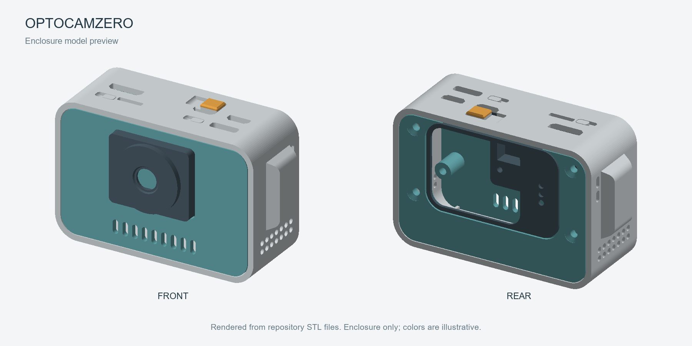

# Optocamzero Build (PiSugar 3 Air + Raspberry Pi Zero 2 W + Whisplay)

An FDM-printable enclosure for an Optocamzero build using PiSugar 3 Air, Raspberry Pi Zero 2 W, and the Whisplay HAT.

## Model Preview

Rendered from the supplied STL files at their exported assembly positions. The preview shows the enclosure only, without electronic components; colors are illustrative.

## Model Files

- [Print project](print/optocam.3mf): includes the part layout, filament assignments, and per-object print settings.
- [STL files](print/): individual parts for use with your own slicer profile.
- [SolidWorks assembly](optocam-fdm.SLDASM) and [editable parts](parts/): source files for modifying the enclosure. Keep the repository's folder structure, including [shared components](../shared/), when opening the assembly.

### Printable Parts

Quantities below match the supplied 3MF project.

| Part | Quantity | STL file |
| --- | --- | --- |
| Main shell | 1 | [shell](print/optocam-fdm%20-%20shell-1.STL) |
| Front cover | 1 | [front-cover](print/optocam-fdm%20-%20front-cover-1.STL) |
| Back cover | 1 | [back-cover](print/optocam-fdm%20-%20back-cover-1.STL) |
| Screen cover | 1 | [screen-cover](print/optocam-fdm%20-%20screen-cover-1.STL) |
| Camera cap | 1 | [camera-cap](print/optocam-fdm%20-%20camera-cap-1.STL) |
| Button cap | 2 | [click_top](print/optocam-fdm%20-%20click_top-1.STL) |

## Printing

Open `print/optocam.3mf` as a project in Bambu Studio to retain the saved layout and object settings. When using the individual STL files, reproduce the quantities above and check each part's orientation and supports before slicing.

The supplied project stores the following settings; these describe the saved profile and are not a print-validation report.

| Setting | Saved value |
| --- | --- |
| Printer | Bambu Lab H2S |
| Nozzle diameter | 0.4 mm |
| Material profiles | Bambu PLA Matte and Bambu PLA Translucent |
| Layer height | 0.08 mm |
| First layer height | 0.20 mm |
| Wall loops | 2 |
| Infill | 15% gyroid |
| Print sequence | By object |

The front and back covers use the translucent PLA profile; the remaining parts use the matte PLA profile.

Supports are enabled per object: the shell uses automatic tree supports, while the cover group and the camera cap / screen cover / button cap group use automatic normal supports. Check these object overrides rather than relying on the global support switch alone.

Before printing, select your actual printer and filament profiles, review the sliced preview, and check clearance for the saved **by-object** print sequence. Recheck orientation and supports if you rearrange or split the grouped parts.

## Fasteners

| Fastener | Specification | Quantity |
| --- | --- | --- |
| Camera mounting screw | M2 × 3 mm countersunk screw | 4 |
| Hexagonal metal standoff | M2.5 × 9 + 6 mm (9 mm body + 6 mm male thread) | 4 |
| Hex socket flat head metal screw | M2.5 × 10 mm | 4 |

The camera mounting screws are the same type used in the [Pi 5 Whisplay camera mount](../pi5-whisplay-chatbot/README.md#screw-type-for-camera). This Optocamzero build uses **4** camera screws.

## Fit and Assembly Checks

- Remove support material and clean mating edges, openings, and mounting holes before trial fitting.
- Check the fit of the PiSugar 3 Air, Raspberry Pi Zero 2 W, and Whisplay HAT before closing the enclosure.
- Check camera-module and ribbon-cable clearance against the model before choosing camera hardware; the exact supported camera variant is not documented here yet.
- Confirm that the button caps move freely and that cables are not pinched when fitting the covers.
- A verified assembly sequence is not yet documented for this model. Confirm the mounting details against the CAD assembly and your hardware before final assembly.
